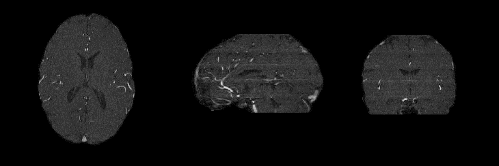
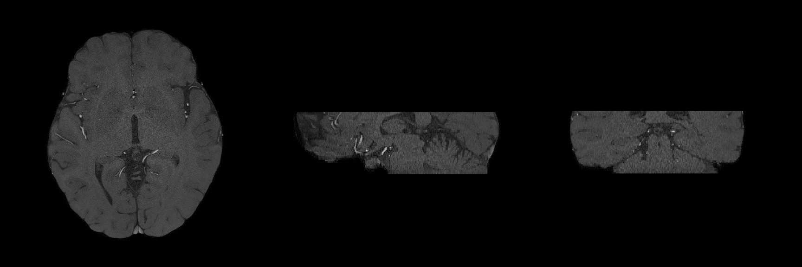
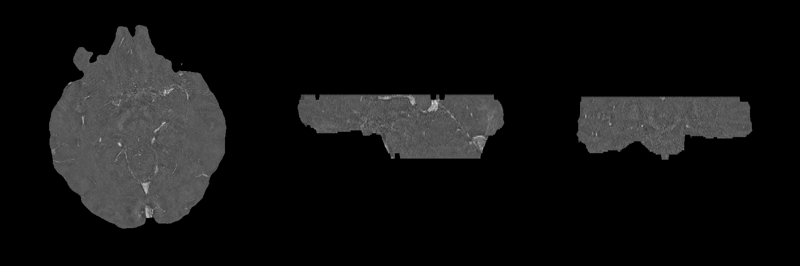
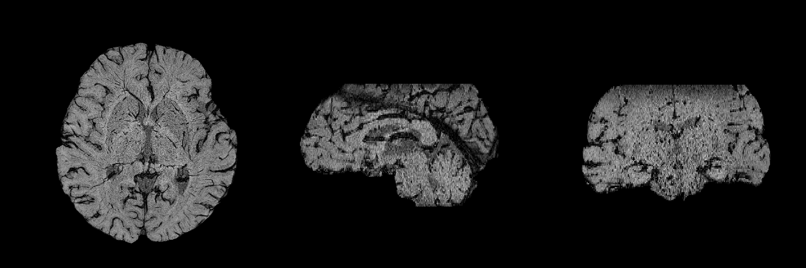
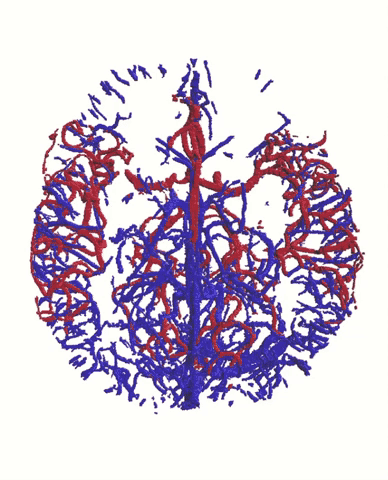
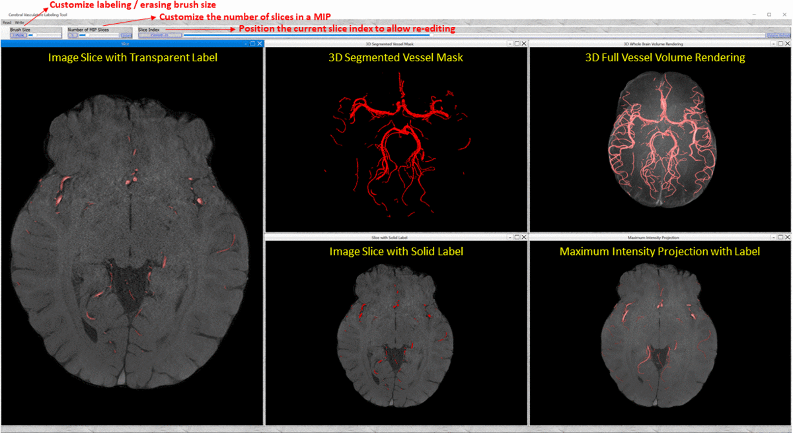

# JointVesselNet_VC-Net
Code Implementation for **JointVesselNet (MICCAI 2020)** &amp; **VC-Net (IEEE SciVis 2020)**\
\
**:eyes:Paper Link:**\
i: JointVesselNet: Joint Volume-Projection Convolutional Embedding Networks for 3D Cerebrovascular Segmentation [MICCAI 2020](https://link.springer.com/chapter/10.1007/978-3-030-59725-2_11)\
\
ii: VC-Net: Deep Volume-Composition Networks for Segmentation and Visualization of Highly Sparse and Noisy Image Data [IEEE TVCG SciVis 2020](https://ieeexplore.ieee.org/document/9222053) and [ArXiv Open Access](https://arxiv.org/abs/2009.06184)
## Network Archetecture

## Dependencies:
The code is run and tested on Ubuntu 16.04 LTS with CUDA 9.0 and Python3, and you may need the following:
* Tensorflow
* Keras
* nibabel
* SimpleITK
* Nipype
* ITKTubeTK
## Dataset:
TubeTK Dataset can be found and downloaded [here](https://public.kitware.com/Wiki/TubeTK/Data). Currently it contains 109 patient cases. There are 42 cases which have the Auxillary Data folder (centerline + radius), such data indices can be found in Directory ```/patch_gen/id_list.txt```.\
\
Preprocess the volume data: 1. Pick MRA modality 2. Skull striping 3. Brain mask computation
```
$ python data_preprocess.py
```
Convert the vessel label .tre file in TubeTK dataset to binary volume image:\
Please refer [here](https://github.com/InsightSoftwareConsortium/ITKTubeTK) or [here](https://public.kitware.com/Wiki/TubeTK/Build_Instructions#Slicer) for building from source and python wrapping instructions.
## Patch Extraction:
The patches have bigger spatial dimensions across axial plane (128 x 128 in our experiments) and 16 along vertical axis. Extract patches randomly from MRA volume and save the required input formats for both 3D and 2D branches, go to ```/patch_gen``` and run:
```
$ python patch_extraction.py --flag train
$ python patch_extraction.py --flag val
```
## Network Training and Testing:
Just run the following script when you get the data ready:) The model by default is trained on multi-GPU, you can disable the multi-GPU training mode in ```/model/vc-net.py``` before the model compilation. Or if you are using higher version of Tensorflow (like TF2.0+), you may need to modify a little bit about how the keras module is imported and use tf.distribute.MirroredStrategy() instead if you have multi-GPUs.
```
$ python train.py
```
When completing the network training, you can test the segmentation performance using the metrics upon your requirements either patchwisedly or casewisely. The performance reported in the paper are computed in terms of the entire volume image which is fed into the network with non-overlapping patches. 

## Result Showcase:
### JointVesselNet:
In MICCAI 2020 paper JointVesselNet, our experiments includes the 3D cerebravascular segmentation from MRA from both TubeTK MRA dataset and our collaborative clinic MRA dataset (the clinic MRA dataset is called as MRAG in MICRO-MRI dataset in SciVis 2020 VC-Net). Typical qualitative results are shown below (key comparison parts are marked in circles):


### VC-Net:
In SciVis 2020 VC-Net, we extended the general 3D cerebravascular segmentation into more challenging and finer scenarios which includes major level arteries/ veins, as well as micro-level vessels, different input image modalities are shown below:

TubeTK MRA (Whole Brain)             |  MICRO-MRI Major-Level MRAG (Midbrain)
:-------------------------:|:-------------------------:
  |  

MICRO-MRI Major-Level MRVG (Midbrain)             |  Original MICRO-MRI Micro-Level SWI (Whole Brain)
:-------------------------:|:-------------------------:
  |  

Qualitative results of major-level vessel segmentation in MICRO MRI dataset (key comparison parts are marked in circles):


Qualitative results of micro-level vessel segmentation in MICRO MRI dataset (key comparison parts are marked in circles):\
    In the error maps:
* :white_circle: True Positive
* :black_circle: True Negative
* :red_circle: False Positive
* :large_blue_circle: False Negative


In MICRO-MRI dataset, the ground truth vessel labels were finally acquired by slice-wise refinement based on the pre-computed vessel labels
by MRAGnls, MRVGavg, and SWIATRG methods, instead of labeling from scratch manually using our specifically-designed cerebrovascular labeling and visualization tool as shown below. 
Three Vascular Systems            |  Vascularture Labeling Tool
:-------------------------:|:-------------------------:
  |  

## Citation
If you find our work useful in your research, please cite our work :smiley::
```
@article{wang2020vc,
  title={VC-Net: Deep Volume-Composition Networks for Segmentation and Visualization of Highly Sparse and Noisy Image Data},
  author={Wang, Yifan and Yan, Guoli and Zhu, Haikuan and Buch, Sagar and Wang, Ying and Haacke, Ewart Mark and Hua, Jing and Zhong, Zichun},
  journal={IEEE transactions on visualization and computer graphics},
  year={2020},
  publisher={IEEE}
}

or

@inproceedings{wang2020jointvesselnet,
  title={JointVesselNet: Joint Volume-Projection Convolutional Embedding Networks for 3D Cerebrovascular Segmentation},
  author={Wang, Yifan and Yan, Guoli and Zhu, Haikuan and Buch, Sagar and Wang, Ying and Haacke, Ewart Mark and Hua, Jing and Zhong, Zichun},
  booktitle={International Conference on Medical Image Computing and Computer-Assisted Intervention},
  pages={106--116},
  year={2020},
  organization={Springer}
}
```
