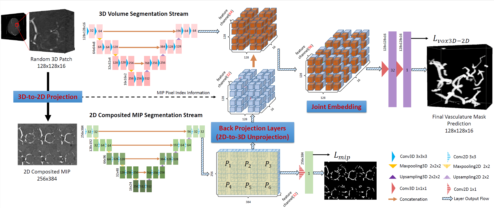

# JointVesselNet_VC-Net
Code Implementation for **JointVesselNet (MICCAI 2020)** &amp; **VC-Net (IEEE SciVis 2020)**\
\
**:eyes:Paper Link:**\
i: JointVesselNet: Joint Volume-Projection Convolutional Embedding Networks for 3D Cerebrovascular Segmentation [MICCAI 2020](https://link.springer.com/chapter/10.1007/978-3-030-59725-2_11)\
\
ii: VC-Net: Deep Volume-Composition Networks for Segmentation and Visualization of Highly Sparse and Noisy Image Data [IEEE TVCG SciVis 2020](https://ieeexplore.ieee.org/document/9222053) and [ArXiv Open Access](https://arxiv.org/abs/2009.06184)
## Network Archetecture

## Dependencies:
The code is run and tested on Ubuntu 16.04 LTS with CUDA 9.0 and Python3, and you may need the following:
* Tensorflow
* Keras
* nibabel
* SimpleITK
* Nipype
* ITKTubeTK
## Dataset:
TubeTK Dataset can be found and downloaded [here](https://public.kitware.com/Wiki/TubeTK/Data). Currently it contains 109 patient cases. There are 42 cases which have the Auxillary Data folder (centerline + radius), such data indices can be found in Directory ```/patch_gen/id_list.txt```.\
\
Preprocess the volume data: 1. Pick MRA modality 2. Skull striping 3. Brain mask computation
```
$ python data_preprocess.py
```
Convert the vessel label .tre file in TubeTK dataset to binary volume image:\
Please refer [here](https://github.com/InsightSoftwareConsortium/ITKTubeTK) or [here](https://public.kitware.com/Wiki/TubeTK/Build_Instructions#Slicer) for building from source and python wrapping instructions.
## Patch Extraction:
The patches have bigger spatial dimensions across axial plane (128 x 128 in our experiments) and 16 along vertical axis. Extract patches randomly from MRA volume and save the required input formats for both 3D and 2D branches, go to ```/patch_gen``` and run:
```
$ python patch_extraction.py --flag train
$ python patch_extraction.py --flag val
```
## Network Training and Testing:
Just run the following script when you get the data ready:)
```
$ python train.py
```
When completing the network training, you can test the segmentation performance using the metrics upon your requirements either patchwisedly or casewisely. The performance reported in the paper are computed in terms of the entire volume image which is fed into the network with non-overlapping patches. 

